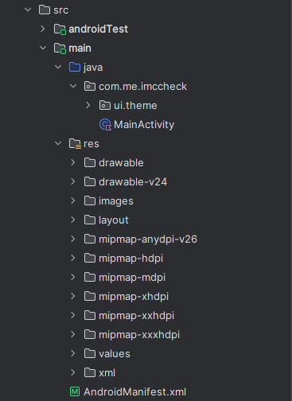
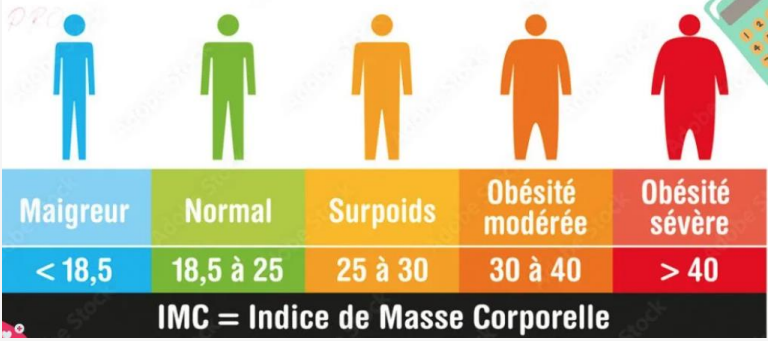
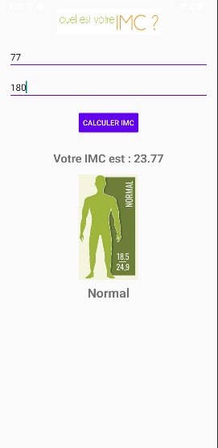

<h1>BMI Check Android App 📱</h1>

Une application moderne et intuitive pour calculer l'IMC (Indice de Masse Corporelle) sur Android, développée en Kotlin et suivant les principes de Material Design.

<h3>Fonctionnalités</h3>

Calcul IMC Facile : Saisissez poids (kg) et taille (cm) pour obtenir instantanément votre IMC
Affichage Visuel des Catégories : Catégories IMC avec codes couleur et icônes représentatives
Interface en Français : Interface complètement en français
Validation des Entrées : Gestion robuste des erreurs pour les saisies invalides
Interface Moderne : Design Material moderne et épuré
Résultats en Temps Réel : Calcul instantané et affichage des catégories

<h3> Structure du Projet </h3>

<h3> Catégories IMC </h3>

<h3> Result </h3>

